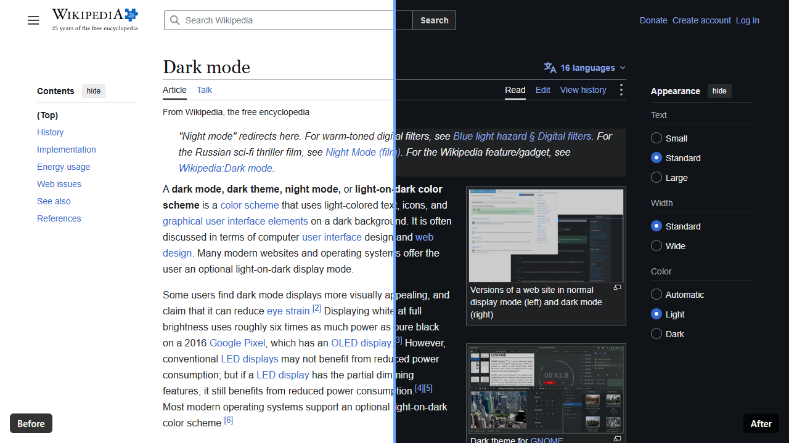
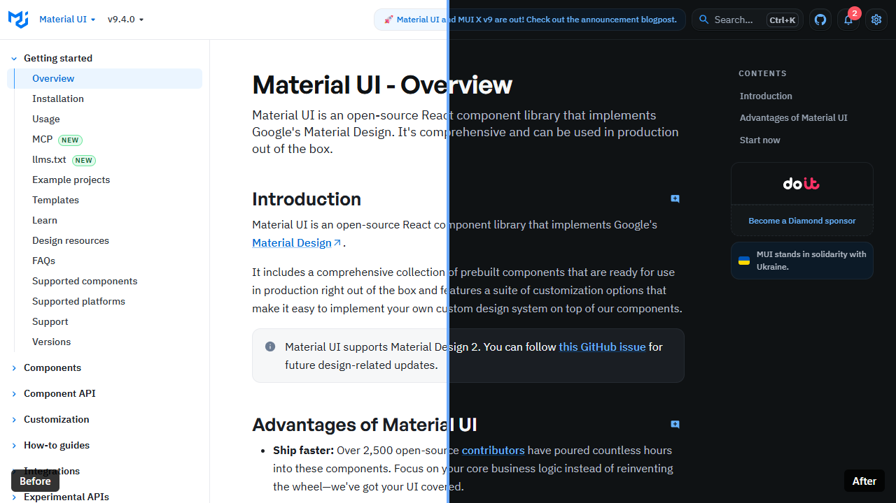
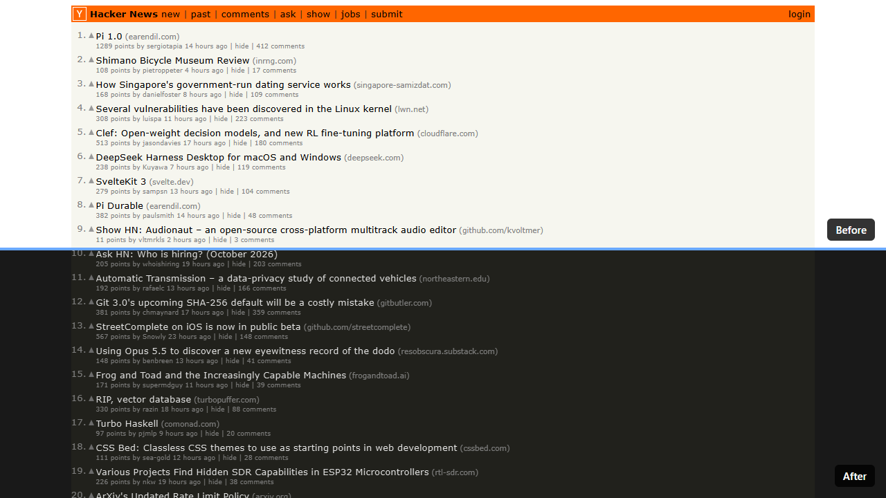
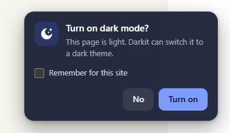

<div align="center">


# Darkit

**Dark mode for every website. The site's own dark theme first, a reading-friendly filter when there is none.**

A tiny browser extension for Microsoft Edge and Google Chrome.

[](https://github.com/phanxuanquang/darkit/actions/workflows/ci.yml)
[](https://github.com/phanxuanquang/darkit/releases)
[](LICENSE)



</div>

## Why Darkit?

Most dark mode extensions invert or repaint every page the same way. That works, but it ignores something many websites already have: a dark theme their designers built, hidden behind a toggle you have to find on every site.

Darkit tries that first. It looks for the switch the site itself uses, flips it, and you get the real thing: the designer's colors, crisp images, nothing looking "inverted". Only when a site has no dark theme does Darkit fall back to its own filter, and that filter is tuned for long reading rather than maximum contrast.

## Features

### Uses the site's own dark theme

Darkit recognizes the dark mode switches of popular frameworks and sites, including Tailwind CSS, shadcn/ui, Radix, Bootstrap, MUI, Mantine, Docusaurus, VitePress, MkDocs Material, GitHub and MediaWiki (Wikipedia).



### A gentle filter for everything else

Sites without a dark theme get a filter that lands on about 14:1 contrast (`#1a1a1a` background, `#e6e6e6` text) instead of harsh pure black and white, which is easier on the eyes for long reading. Images and videos keep their real colors.



### Asks once, then remembers

On a light page, a small prompt offers dark mode. Tick _Remember for this site_ and Darkit applies it on every visit, before the page is drawn, so there is no white flash.



### Follows your system, stays out of the way

- Automatic dark mode only runs while your system or browser theme is dark, and switches live, for example at sunset. In a bright room, light pages read better.
- Pages that are already dark are left alone.
- One click on the toolbar icon toggles dark mode on any tab, at any time.

### Light and private

No tracking, no accounts, no network requests, no runtime dependencies. Nothing runs in the background when idle.

## Install

Darkit is on its way to Microsoft Edge Add-ons and the Chrome Web Store. Until it's listed, install it from source:

1. Download the latest `darkit-<version>.zip` from [Releases](https://github.com/phanxuanquang/darkit/releases) and unzip it, or clone this repository.
2. Open `edge://extensions` (Edge) or `chrome://extensions` (Chrome).
3. Turn on **Developer mode**.
4. Click **Load unpacked** and pick the unzipped folder (or `src/` in a clone).

Requires Edge or Chrome 116+. For automatic dark mode, set the browser appearance to **System** or **Dark**.

## Using Darkit

| You do                                                 | Darkit does                                                     |
| ------------------------------------------------------ | --------------------------------------------------------------- |
| Click **Turn on** in the prompt                        | Dark mode for this site until you close the browser.            |
| Click **Turn on** with _Remember for this site_ ticked | Dark mode on every visit while your system theme is dark.       |
| Click **No**                                           | Not asked again this session (or ever, with _Remember_ ticked). |
| Click the toolbar icon                                 | Toggles dark mode on the current tab right away, at any time.   |
| Right-click the icon > **Forget choice for this site** | Clears the remembered choice; the site will be asked again.     |

Browser pages (`edge://`, `chrome://`, the extension stores) and local `file://` pages can't be changed by extensions.

## How it works

1. **Is the page already dark?** When a page loads, Darkit samples the background at five points and computes its brightness (WCAG luminance). If most points are dark, it does nothing.
2. **Does the site have its own dark theme?** Darkit tries the common dark mode switches on `<html>` and `<body>` (such as `class="dark"`, `data-theme="dark"`, `data-bs-theme="dark"`) and keeps the first one that really makes the page dark.
3. **Otherwise, the filter.** It applies `invert(1) hue-rotate(180deg) contrast(0.8)` to the page and flips images and video back.

Everything goes through a single switch, so turning dark mode off restores the page exactly as it was.

## Privacy

Darkit collects nothing and sends nothing anywhere. The only thing it stores is the list of sites you chose to remember, in your browser's local extension storage. It asks to "read and change data on all websites" because it has to look at each page's colors and apply dark mode wherever you browse.

## Known limitations

- **Filter mode** makes very saturated image colors slightly duller, turns dark parts of a light page (such as a dark header) light, and doesn't re-invert CSS background images.
- **Sites that keep their theme only in JavaScript**, such as apps built with MUI v5 `ThemeProvider`, Ant Design, Vuetify, Fluent UI or Astryx, can't be switched to their own dark theme from outside; they get the filter.
- **Sites that follow `prefers-color-scheme` only** can't be forced dark while your system is light; they turn dark on their own when it is dark.

## Contributing

Issues and pull requests are welcome, especially reports of sites where Darkit picks the filter even though the site has a dark theme.

```sh
npm install
npx playwright install chromium
npm test
```

`npm test` runs a unit test and end-to-end tests that load the extension into a real Chromium. Set `CHROME` to point at another Chromium binary if needed. The code is plain JavaScript with no build step:

```text
src/
  manifest.json   MV3 manifest, shared by Edge and Chrome
  background.js   storage, toolbar icon, context menu, remembered sites
  detect.js       page detection, native dark switches, prompt
  on.js           early dark mode for remembered sites
  dark.css        filter theme
  icons/          icon.svg + generated PNGs (npm run icons)
scripts/          icon generator, zip packager
test/             unit + end-to-end tests
docs/images/      README screenshots
```

### Adding a framework

Supporting another framework's dark theme is usually one line in `NATIVE` in [src/detect.js](src/detect.js):

```js
val('data-foo-theme', 'dark'), // FooUI: attribute value on <html>
cls('dark-ui'), // FooUI: class token on <html>
cls('dark-ui', true), // FooUI: class token on <body>
```

The end-to-end tests pick up new entries automatically. To find a site's switch, run the snippet in [.claude/skills/add-framework/SKILL.md](.claude/skills/add-framework/SKILL.md) in its DevTools console and press the site's own theme toggle. With [Claude Code](https://claude.com/claude-code), `/add-framework` walks through the whole process.

### Releasing

The version lives in `src/manifest.json`.

1. Bump `version` and commit: `git commit -am "chore(release): v0.2.0"`.
2. Tag and push: `git tag -a v0.2.0 -m v0.2.0 && git push --follow-tags`.
3. The Release workflow checks the tag matches the manifest, runs the tests and attaches `darkit-<version>.zip` to a GitHub Release.
4. Upload that zip to Microsoft Partner Center and the Chrome Web Store Developer Dashboard.

`npm run zip` builds the same archive locally into `dist/`. CI runs `prettier --check`, the tests and the zip build on every push and pull request.

## License

[MIT](LICENSE) © Phan Xuan Quang
